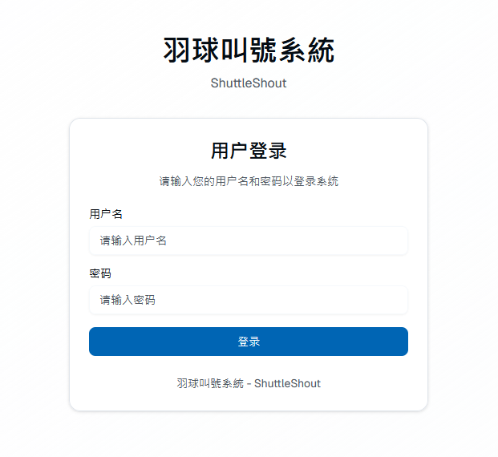
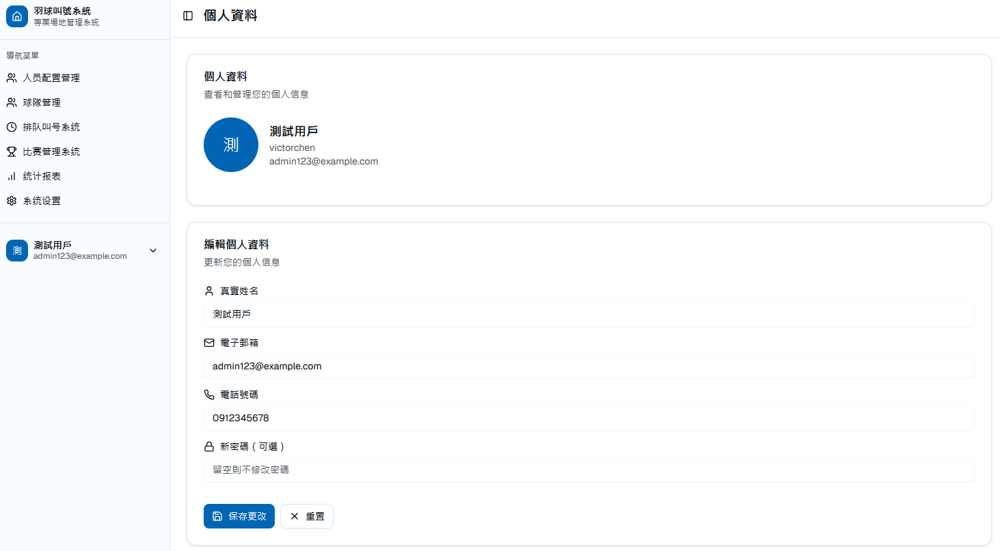
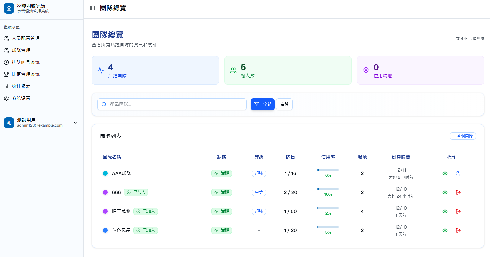
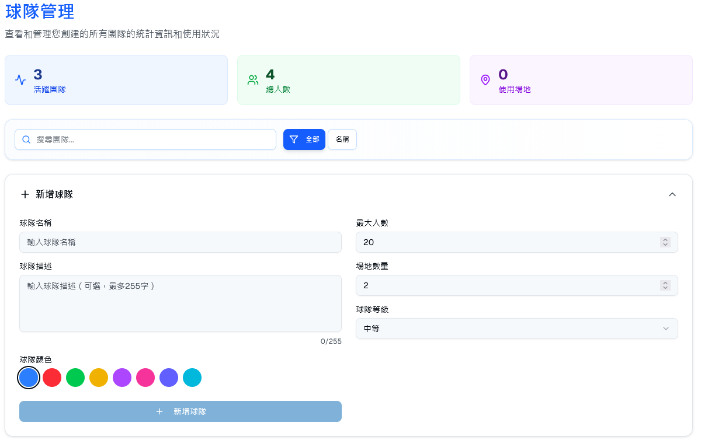
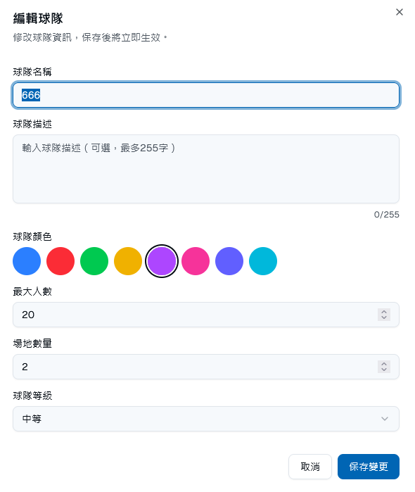
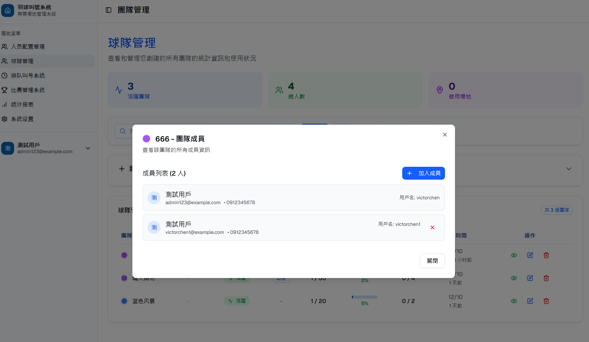
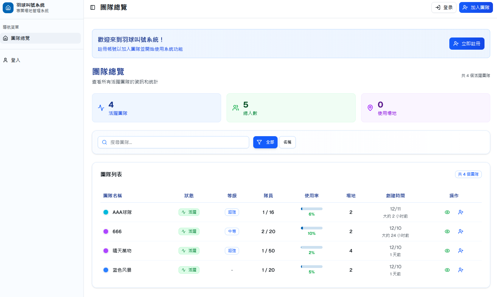

# Shuttle Shout - Badminton Queue Management System

## Language / 语言

- [English](README.md) | [中文](README_ZH.md)

---

## Current Development Status

**Note:** This project is currently under active development. Currently implemented features:

- ✅ User authentication and authorization (registration, login, JWT tokens)
- ✅ User profile management
- ✅ Team management (create, update, delete teams, member management, team levels)
- ✅ Resource page management and role-based access control
- ✅ WebSocket real-time team calling system
- ✅ Court management (create, update, query courts, player assignment)
- ✅ Match management (create, finish matches, track match status)

Other features (player management, queue history, statistics) are planned for future releases.

---

## Project Overview

Shuttle Shout is a comprehensive badminton queue management system consisting of frontend and backend components. The system is designed to manage players, courts, and queue systems, helping badminton venues efficiently manage their queue and calling processes.

## Tech Stack

### Frontend
- **React 19**
- **Next.js 16**
- **TypeScript**
- **Tailwind CSS**
- **Radix UI**

### Backend
- **Java 17**
- **Spring Boot 3.2.0**
- **Spring Data JPA**
- **Gradle**
- **H2 Database** (Development) / **PostgreSQL** (Production)

## Project Structure

```
shuttle-shout/
├── shuttle-shout-frontend/  # React Frontend Project
│   ├── app/                 # Next.js App Directory
│   ├── components/          # React Components
│   ├── hooks/              # Custom Hooks
│   └── lib/                # Utility Libraries
│
└── src/                    # Spring Boot Backend Project
    ├── main/java/com/shuttleshout/
    │   ├── controller/     # REST API Controllers
    │   ├── service/        # Business Logic Layer
    │   ├── repository/     # Data Access Layer
    │   └── model/          # Entity Classes and DTOs
    └── resources/          # Configuration Files
```

## Quick Start

### Prerequisites
- Node.js 18+ and npm/pnpm
- JDK 17+
- Gradle 8.5+ (or use the project's Gradle Wrapper)

### Start Frontend

```bash
cd shuttle-shout-frontend
npm install  # or pnpm install
npm run dev  # or pnpm dev
```

Frontend will run at http://localhost:3000

### Start Backend

```bash
# Windows
gradlew.bat bootRun

# Linux/Mac
./gradlew bootRun
```

Backend will run at http://localhost:8080/api

### WebSocket Connection

The WebSocket endpoint for real-time team calling system:
- WebSocket URL: `ws://localhost:18080/api/ws?teamId={teamId}`

### API Documentation

After starting the backend, access the following URLs to view API documentation:
- Swagger UI: http://localhost:8080/api/swagger-ui.html
- API Docs: http://localhost:8080/api/api-docs

## Features

### User Authentication & Authorization
- ✅ User registration and login
- ✅ Role-based access control (RBAC)
- ✅ JWT token authentication
- ✅ Resource page management
- ✅ User profile management

### Team Management
- ✅ Create and manage teams
- ✅ Team member management
- ✅ Team level management

### Player Management
- ⏳ Create and manage player information (Planned)
- ⏳ Search players (Planned)
- ⏳ Update player information (Planned)

### Court Management
- ✅ Create and manage courts
- ✅ Initialize courts for teams
- ✅ Assign players to courts
- ✅ Remove players from courts
- ✅ View court status and player assignments
- ✅ Batch update court players

### Team Calling System (WebSocket)
- ✅ Real-time WebSocket communication
- ✅ Assign players to courts in real-time
- ✅ Remove players from courts
- ✅ Auto-assign players to courts
- ✅ Finish matches
- ✅ Real-time court status updates
- ✅ Real-time queue updates
- ✅ Multi-client synchronization

### Match Management
- ✅ Create matches
- ✅ Track match status (ONGOING, FINISHED, CANCELLED)
- ✅ Finish matches
- ✅ Query ongoing matches
- ✅ Match history tracking

### Queue System
- ⏳ Join waiting queue (Planned)
- ⏳ Queue history records (Planned)
- ⏳ Statistics and reporting (Planned)

## UI Demo

Below are screenshots of the main features of the system:

### Login Page


### Personal Page


### Team Overview


### Create Team


### Edit Team


### Team Members Management


### Anonymous Team Overview


## Development Roadmap

- [x] WebSocket real-time notifications
- [x] Court management
- [x] Match management
- [x] User authentication and authorization
- [ ] Queue history records
- [ ] Statistics and reporting features
- [ ] Multi-language support

## License

MIT License
